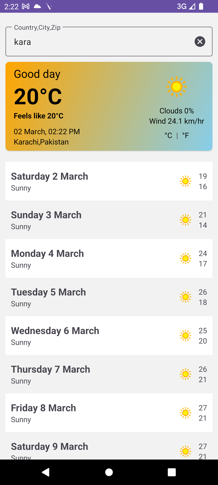
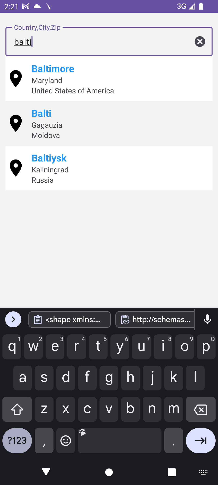
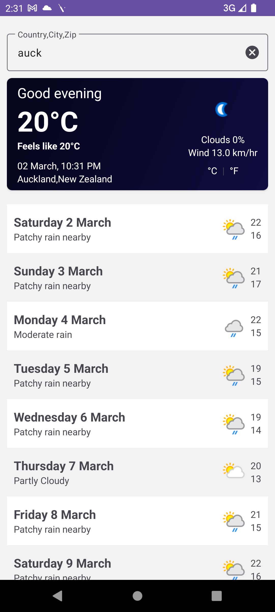

# Weather Forecasting Android App

Welcome to Weather Forecasting Android App! This app provides you with accurate and up-to-date weather information, allowing you to stay informed about the weather conditions in any location. With a user-friendly interface and a range of features, it's your go-to companion for weather updates on the go.

| Current Weather | Search Functionality | 15-Day Forecast |
| --- | --- | --- |
|  |  |  |

## Features

1. **Current Weather**: Instantly view the current weather conditions at your location or any other location of interest.

2. **Search Functionality**: Seamlessly search for weather forecasts by country, city, or specific coordinates (latitude and longitude).

3. **15-Day Forecast**: Get a comprehensive overview of the weather forecast for the next 15 days, enabling you to plan ahead with confidence.

4. **Pull-to-Refresh**: Easily refresh the weather data by pulling down on the screen, ensuring you have the latest updates at your fingertips.

## Technologies Used

- **Architecture**: Employed n-layer architecture for a well-structured and maintainable codebase.
- **Dependency Injection**: Utilized Koin for efficient dependency injection, enhancing modularity and testability.
- **Kotlin Coroutines**: Leveraged Kotlin Coroutines for asynchronous and non-blocking programming, ensuring smooth performance.
- **Flow**: Integrated Kotlin Flow for reactive programming, facilitating the handling of asynchronous data streams.
- **Retrofit**: Employed Retrofit for making network requests, simplifying API integration and data retrieval.
- **OkHttp**: Used OkHttp as the HTTP client for efficient and reliable network communication.
- **Material Design**: Implemented Material Design principles for a modern and visually appealing user interface.

## Download APK

You can download the APK for the Weather Forecasting Android App from the following link: [WeatherApp.apk](https://drive.google.com/file/d/1fRV6Cm9-ZML-EwYdSHMDCuQ2VtCoXJvN/view?usp=sharing)

## Getting Started

To get started with the Weather Forecasting Android App, follow these steps:

1. Clone the repository to your local machine.
2. Open the project in Android Studio.
3. Build and run the app on an Android device or emulator.
4. Explore the various features and enjoy accurate weather forecasts on the go!

## Contact

For any inquiries or support, feel free to contact us at [noman.noor@hotmail.com].

Enjoy using the Weather Forecasting Android App!
